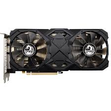

# 🏴‍☠️ SOYO RX 580 2048SP (The Frankenstein Mod)

<!-- BADGES -->

<h3>Turning a cheap Chinese refurb into a Mac Pro compatible beast.</h3>

---

## 💀 The Situation

Listen, I know what you bought. You went on AliExpress and bought this "Soyo" RX 580 2048SP. It cost you peanuts.
It's a re-soldered, re-flashed, Frankestein's monster of a card. It's ugly, it's sketchy, but it works.

**The Problem:**
This card is effectively an RX 570 in disguise, but with a weird Device ID (`6FDF`).
*   **Windows:** Works fine with hacked drivers.
*   **macOS:** Dead silence. No acceleration. Black screen. macOS looks at this ID and says "I don't know you."

**The Solution:**
We don't just flash a random RX 570 BIOS (that breaks your ports). We perform surgery on the **original** BIOS to spoof the ID while keeping the correct memory timings and port layout.

---

## 🕵️ The "Soyo" Mystery (Trust Nobody)

Here is the kicker. When you plug this card in, **GPU-Z** will look you in the eye and tell you the memory is **Hynix**.

**GPU-Z is lying.**
I took this card apart. I looked at the chips with my own eyes. They are **Samsung**.
Typical Chinese refurb shenanigans. They flashed a BIOS with Hynix timings onto Samsung memory (or vice versa). This is why you cannot trust random BIOS files from the internet for this specific card.

**This repo contains the modified BIOS specifically for this weird Samsung-chip variant.**

  
  

---

## 💉 The Mod (Hex Editing Surgery)

I didn't invent this; I just perfected it for this specific card.
We modified the original `Ellesmere.rom` to identity as a pure RX 570 (`67DF`).

### Technical Details
We opened the binary in a Hex Editor and made these changes:

#### 1. The Model ID (Offset `0xD4`)
The card originally identified as a weird 2048SP variant.
*   **Original:** `F0 FD E6 0F` (Unknown / 2048SP)
*   **Patched:** `F0 7D E6 0F` (RX 570 Signature)

#### 2. The Device ID
We need macOS to see `67DF`.
*   **Original:** `02 10 DF 6F`
*   **Patched:** `02 10 DF 67`

*Note: This sequence appeared twice in the binary. Both were patched.*

#### 3. Checksum Fix
After editing, the BIOS signature was invalid. I used **Polaris BIOS Editor** to re-sign and fix the CRC.

---

## 📂 Files in Repo

*   `Ellesmere_MOD.rom` - **THE MODDED BIOS.** Flash this one.(not avaiable)
*   `Ellesmere.zip` - The backup of the original factory BIOS (just in case you brick it).
*   `/photos` - Proof that this card actually exists.

---

## ⚡ Results

*   **macOS (Hackintosh/MacPro):** Full Metal acceleration. Recognized natively.
*   **Performance:** ~44k in Geekbench 5 Metal test.
*   **Outputs:** All ports work (because we kept the original connector map).

---

## 🛠 How to Flash

**Option A: The Cowboy Way (Software)**
1.  Boot into Windows.
2.  Use `amdvbflash` (version 2.93+ recommended for Polaris).
3.  Run: `amdvbflash -f -p 0 Ellesmere.rom`
4.  Pray.
5.  Reboot.

**Option B: The Professional Way (Hardware)**
I used a **CH341a Programmer** with a clip.
1.  Clip onto the BIOS chip.
2.  Read backup.
3.  Write `Ellesmere.rom`.
4.  This is 100% safe because you can't brick the card if you have a hardware flasher.

---

**⚠️ DISCLAIMER ⚠️**
*Flashing a GPU BIOS carries risks. I am not responsible if your card explodes, turns into a toaster, or becomes sentient. This worked for my specific "Soyo" card with Samsung memory. Check your memory chips before flashing!*

